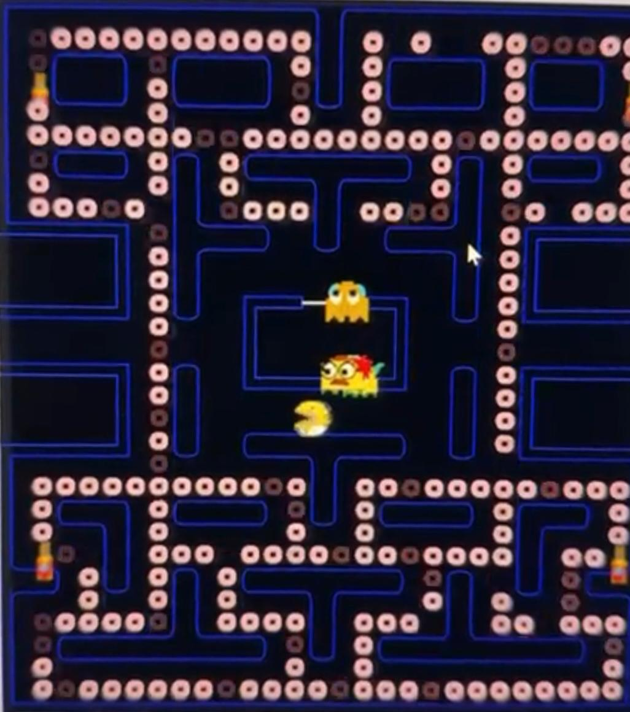
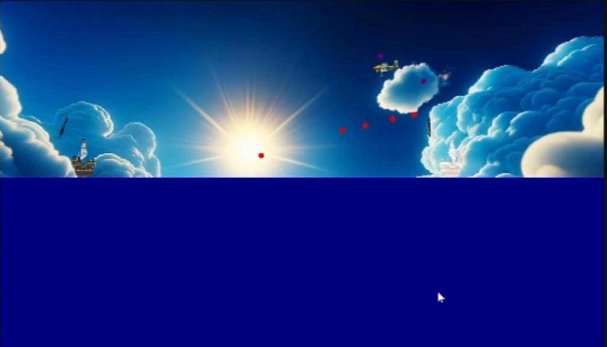
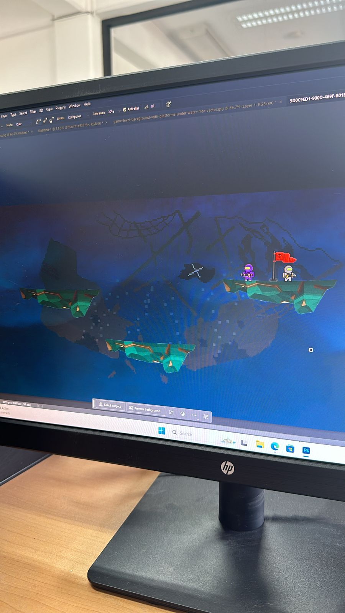

# 🎮 Laboratorio de Videojuegos

## 🟡 Pac-Man versión Simpsons

Un homenaje al clásico Pac-Man, pero con un toque especial: está inspirado en el universo de *Los Simpson*. Cada fantasma tiene el comportamiento de la versión original (sí, con su propio estilo de persecución). Solo tienes una vida, así que no hay margen para errores. Todo está hecho en C#.

yt video: https://youtube.com/shorts/lm8HUDkrr4k?feature=share

## 🚢 Batalla Naval (Barcos)

Dos barcos en una batalla uno contra uno. El objetivo es acertarle más veces al otro barco mientras el mar sube y baja (sí, la marea cambia). Además, el cañón se mueve, así que apuntar no es tan fácil como parece. ¡Buen timing y puntería son clave!

yt video: https://youtu.be/RHu-QiyxGAs

## 🤿 Buzos Shooter

Inspirado en *Smash Bros*, este es un juego multijugador en el que hasta 3 personas pueden controlar buzos que luchan entre sí. El objetivo: derribar a los otros y capturar la mayor cantidad de banderas. Caos, acción rápida y mucha competencia bajo el agua.

